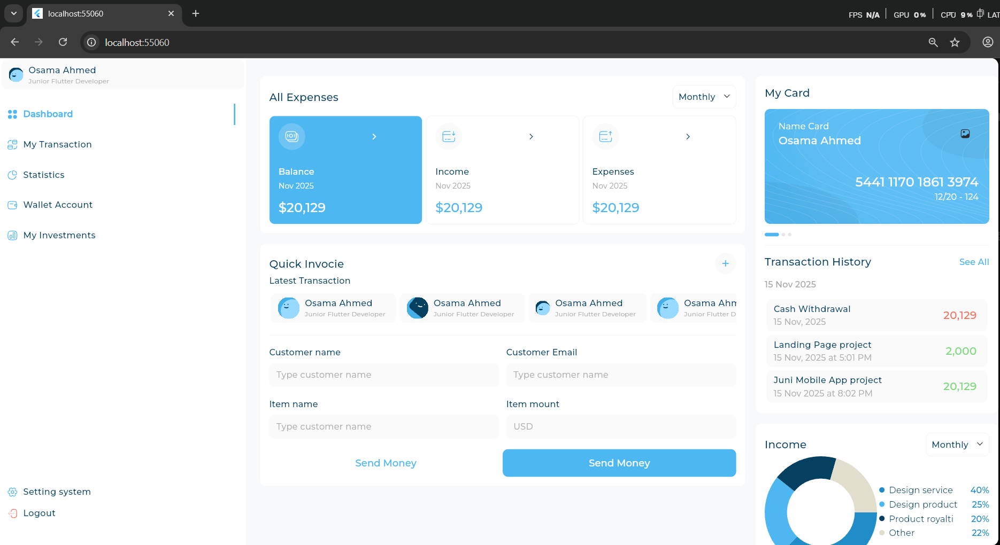
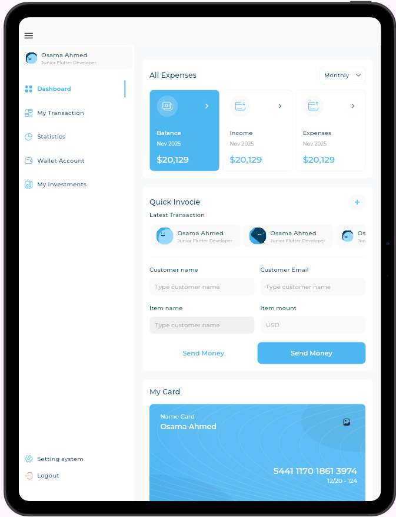
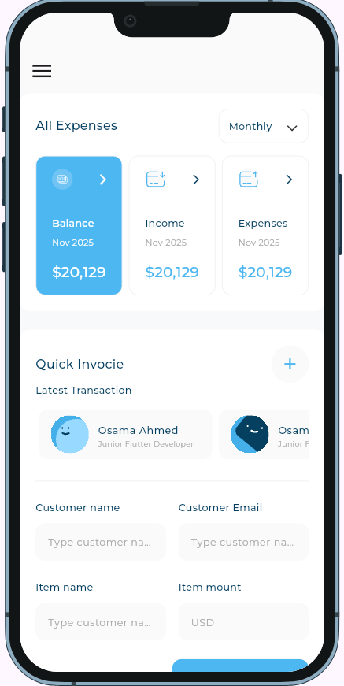

# Responsive Dashboard 💼✨

[](https://flutter.dev)
[](https://dart.dev)
[](https://pub.dev/packages/device_preview)

A sleek finance-style dashboard powered by **Flutter**. Built to practice
responsive layouts, custom widgets, and interactive charts—all while keeping the
experience consistent across desktop, tablet, and mobile. 🚀

---

## Features ✨

- **Adaptive Layouts** 🖥️📱  
  `AdaptiveLayoutWidget` automatically swaps between desktop, tablet, and mobile
  compositions using the breakpoints in `SizeConfig`.

- **Sidebar Navigation** 📂  
  Custom drawer with profile card, navigation shortcuts, and logout action—
  collapses elegantly on smaller devices.

- **Dashboard Insights** 📊  
  Expense summaries, income trends (`fl_chart`), card balances, and transaction
  history blocks with seeded sample data.

- **Quick Invoice Workflow** 🧾  
  A compact form and CTA buttons that showcase form styling and button states.

- **Rich Visuals** 🎨  
  Montserrat typography, SVG illustrations, gradient cards, and subtle shadows
  sourced from the assets bundle.

- **Device Preview Ready** 🔄  
  `DevicePreview` ships enabled so you can view multiple devices without leaving
  the same session.

---

## Screenshots 📸

<div align="center">

| 🖥️ Desktop | 📱 Tablet | 📱 Mobile |
|:---:|:---:|:---:|
|  |  |  |

</div>

---

## Installation ⚙️

1. **Clone the repository**
   ```bash
   git clone <repo-url>
   cd Responsive-Dashboard
   ```
2. **Install dependencies**
   ```bash
   flutter pub get
   ```
3. **Run on your favorite device**
   ```bash
   flutter run -d chrome   # or android/ios/windows/macos/linux
   ```

> Tip: Toggle `enabled` to `false` inside `DevicePreview` in `lib/main.dart` if
> you prefer a standard `runApp`.

---

## Project Structure 📂

```bash
lib/
├── main.dart                 # Entry point + DevicePreview
├── views/
│   └── dashboard_view.dart   # Scaffold + adaptive layout orchestration
├── widgets/                  # Drawer, cards, charts, quick invoice, etc.
├── models/                   # Expense, transaction, user info models
└── utils/                    # SizeConfig, styles, image enums
assets/
├── fonts/                    # Montserrat weights
└── images/                   # SVGs + layout references
```

---

## Key Learnings 🧠

- Crafted a responsive UI without sacrificing visual density.
- Leveraged `CustomScrollView` + slivers for flexible desktop spacing.
- Wired up `fl_chart`, `flutter_svg`, and `expandable_page_view` for rich
  interactions.
- Automated asset access via `flutter_gen_runner`.

---

## Tech Stack 🛠️

- **Framework:** Flutter 3.9.2 | Dart 3.9.2
- **UI Toolkit:** Material 3 + custom theming
- **Packages:** `device_preview`, `flutter_svg`, `fl_chart`,
  `expandable_page_view`, `flutter_gen_runner`
- **Fonts & Assets:** Montserrat family + SVG/PNG illustrations

---


## Acknowledgements 🙏

[](https://flutter.dev/) for the framework  
[](https://pub.dev/packages/fl_chart) for the sparkline magic  
[](https://pub.dev/packages/device_preview) for multi-device testing bliss

---
